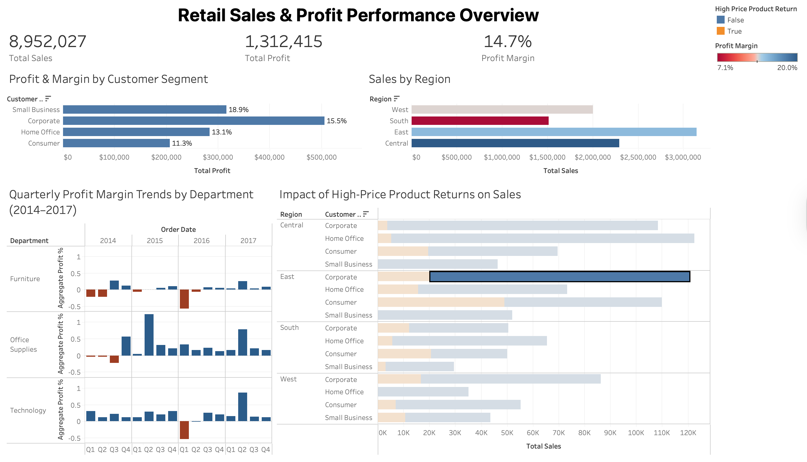

# Retail Sales & Profit Performance Dashboard

## Overview

This project presents an interactive Tableau dashboard analyzing retail sales performance, profitability trends, and the impact of high-price product returns using the Superstore dataset.

The dashboard integrates regional sales analysis, customer segment profitability, quarterly trend evaluation (2014–2017), and return-rate impact metrics to provide a structured performance overview.

---

## Business Questions Addressed

- Which regions generate the highest revenue?
- Which customer segments contribute the most profit?
- How have profit margins trended over time?
- What percentage of sales are associated with high-price product returns?

---

## Key Features

- KPI summary including Total Sales, Total Profit, and Profit Margin  
- Correctly aggregated profit margin calculation:  
  `SUM(Profit) / SUM(Sales)`  
- High Price Return Rate metric using conditional aggregation  
- Quarterly profit margin trend analysis (2014–2017)  
- Interactive region filtering across dashboard views  
- Structured layout using Tableau containers for executive-style presentation  

---

## Tools Used

- Tableau Public  
- Calculated fields and conditional logic  
- Data aggregation and financial metric analysis  
- Interactive dashboard design  

---

## Dashboard Preview

---

## Live Interactive Version

https://public.tableau.com/views/RetailSalesProfitPerformanceDashboard/RetailSalesProfitPerformanceDashboard?:language=en-US&publish=yes&:sid=&:redirect=auth&:display_count=n&:origin=viz_share_link
